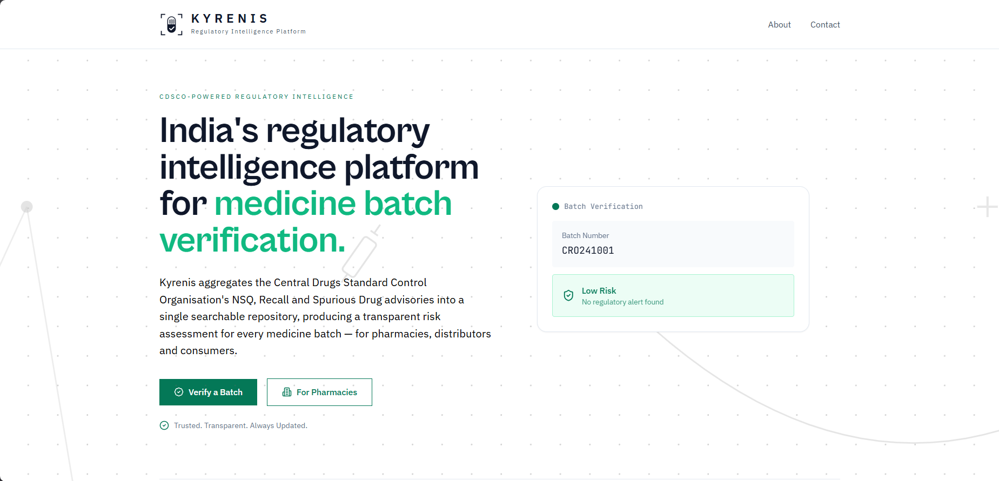
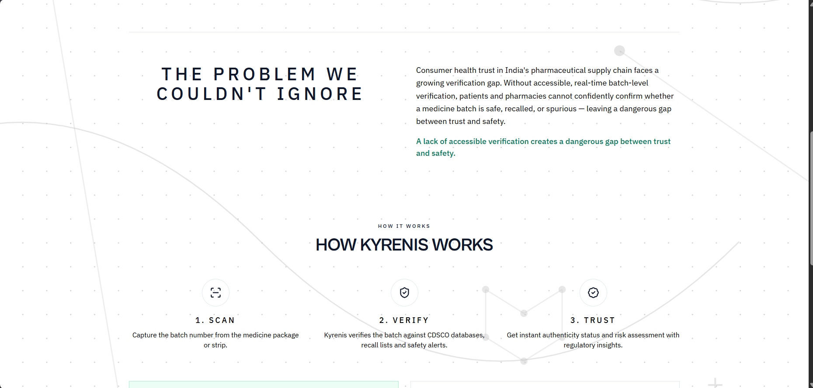
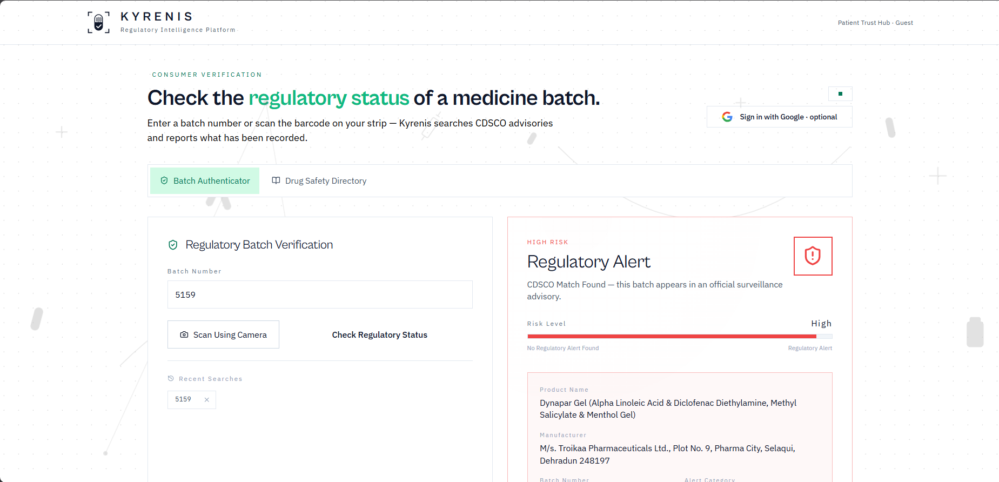
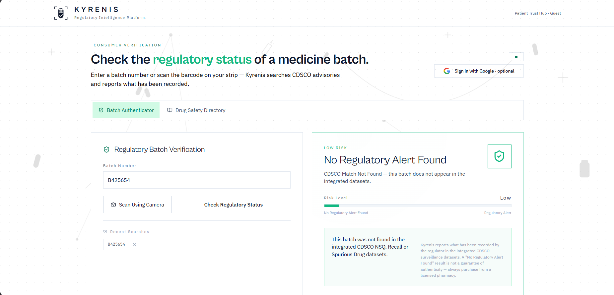
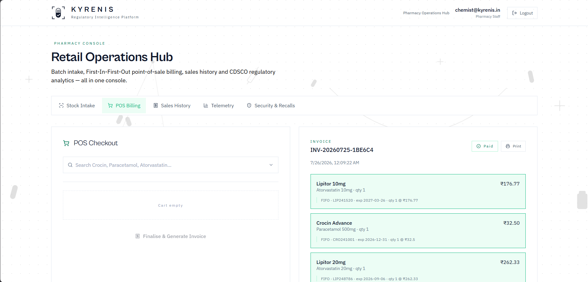
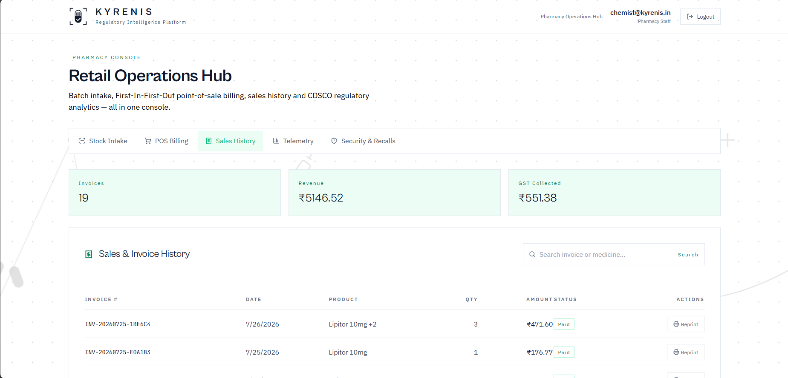

# 💊 Kyrenis

**Kyrenis** is an AI-powered Pharmacy Operating System built to improve medicine safety, streamline pharmacy operations, and help combat counterfeit drugs. It combines inventory management, intelligent batch verification, AI assistance, and public medicine information into a unified platform.

🌐 **Live Demo:** [Kyrenis](https://kyrenis.vercel.app)

---

## 🚀 Features

### 🏥 Pharmacy Dashboard
- Modern analytics dashboard
- Inventory overview
- Sales and stock insights
- Medicine management
- Batch tracking

### 🔐 Authentication
- Secure user authentication
- Role-based access
- Persistent login sessions

### 💊 Medicine Management
- Add, update and remove medicines
- Batch-wise inventory
- Expiry date tracking
- Stock monitoring

### 🛡️ Counterfeit Detection
- Verify medicine batches
- Batch authenticity validation
- Recall alerts
- Safety verification

### 🌍 OpenFDA Integration
- Search medicines
- Drug information lookup
- Usage details
- Safety information

### 📊 Distributor Management
- Distributor database
- Inventory supply tracking
- Purchase management

### 📱 Consumer Portal
- Verify medicine authenticity
- Check batch details
- View medicine information
- Report suspicious products

---

## 📸 Screenshots

### Dashboard
<table>
  <tr>
    <td></td>
    <td></td>
  </tr>
</table>

### Batch Verification

<table>
  <tr>
    <td></td>
    <td></td>
  </tr>
</table>

### Pharmacy Portal

<table>
  <tr>
    <td></td>
    <td></td>
  </tr>
</table>

---

## 🛠️ Tech Stack

### Frontend
- React
- CRACO
- JavaScript
- CSS

### Backend
- FastAPI
- Python
- MongoDB
- Motor (Async MongoDB Driver)

### APIs
- OpenFDA API

### Deployment
- Frontend: Vercel
- Backend: Render
- Database: MongoDB Atlas

---

## 📂 Project Structure

```
Kyrenis/
├── frontend/
│   ├── public/
│   ├── src/
│   └── package.json
│
├── backend/
│   ├── server.py
│   ├── requirements.txt
│   └── ...
│
└── README.md
```

---

## ⚙️ Environment Variables

### Frontend

Create a `.env` file inside the frontend directory.

```env
REACT_APP_BACKEND_URL=https://your-render-url.onrender.com
```

### Backend

Create a `.env` file inside the backend directory.

```env
MONGODB_URI=your_mongodb_connection_string

JWT_SECRET=your_secret

OPENFDA_API_KEY=your_openfda_api_key

CORS_ORIGINS=http://localhost:3000,https://kyrenis.vercel.app
```

---

## 🚀 Running Locally

### Clone the repository

```bash
git clone https://github.com/MehulNegi/Kyrenis.git
cd Kyrenis
```

### Frontend

```bash
cd frontend
npm install
npm start
```

Runs on:

```
http://localhost:3000
```

---

### Backend

```bash
cd backend
pip install -r requirements.txt
uvicorn server:app --reload
```

Runs on:

```
http://localhost:8000
```

---

## 🎯 Vision

Counterfeit medicines remain a major healthcare challenge worldwide. Kyrenis aims to leverage AI and modern web technologies to help pharmacies improve medicine safety, inventory management, and operational efficiency while empowering consumers to verify medicine authenticity.

---

## 👥 Team

Built with ❤️ by

- **[Mehul Negi](https://github.com/MehulNegi)**
- **[Rishabh Agrawal](https://github.com/rishabh124122)**
- **[Swasti Nayak](https://github.com/Swasti-Soumyaa)**
- **[Vinay Bichchali](https://github.com/vinay34744)**
- **[Vaibhvi Kataria](https://github.com/vaibhvii)**

---